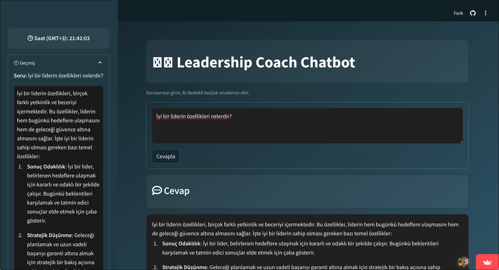

# 🧠 Leadership-Coach-Chatbot

A Turkish leadership coach chatbot built with **local embeddings** and **GPT-4**, supported by Google search fallback.

This chatbot is designed to provide answers and insights related to leadership topics using a combination of similarity-based retrieval and advanced language modeling.


---

## 🔧 Features

- 💬 **Chat interface** with Streamlit
- 📁 Uses **local JSON embedding chunks**
- 🔍 **Google Search fallback** if no relevant answer is found
- 🤖 Powered by **GPT-4** (via OpenAI)
- 🌐 Turkish-language focused
- 🧠 Embedding model: `sentence-transformers/paraphrase-multilingual-MiniLM-L12-v2`

---

## 🖼️ Screenshot

Here’s a quick look at the interface:




---

### 🔗 Demo

[![Try it out]](https://aiturkishleadershipcoach.streamlit.app/)


## 📁 Project Structure

```
Leadership-Coach-Chatbot/
├── streamlit_leadership_chatbot.py   # Main Streamlit app
├── transcript_maker_whisper.py       # (Optional) transcript preprocessor
├── turkish_chunks.json               # Precomputed embedding chunks
├── upload_to_weaviate.py             # ❌ Not used in this version
├── requirements.txt
├── README.md
└── screenshots/
    └── 1.png                         # Interface screenshot
```

---

## 🚀 How to Run

1. **Clone the repo**:

```bash
git clone https://github.com/mertkayacs/Leadership-Coach-Chatbot.git
cd Leadership-Coach-Chatbot
```

2. **Install dependencies**:

```bash
pip install -r requirements.txt
```

3. **Run the Streamlit app**:

```bash
streamlit run streamlit_leadership_chatbot.py
```

---

## ⚙️ How It Works

- First, the user’s question is embedded using a multilingual embedding model.
- It’s matched against preloaded chunks (`turkish_chunks.json`) using cosine similarity.
- If the match score is above a threshold, GPT-4 responds using only the matched context.
- Otherwise, the chatbot uses **Google search results** to help answer.

---

## 📝 Notes

- ! Ensure you have OpenAI API and Google Search keys configured via environment variables or directly in the script.
- All embeddings are loaded from local JSON, no database or vector server required.

---

## 🙏 Credits

Built by **Mert Kaya** \
Feel free to fork, extend, or contribute to the project. 
