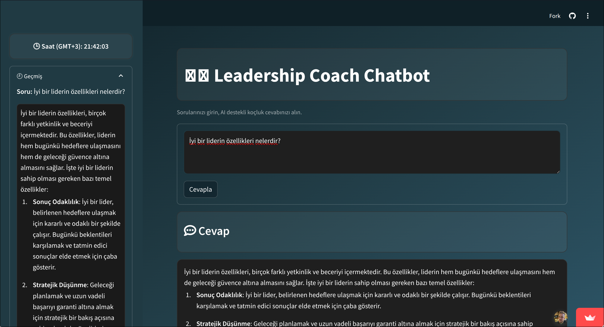
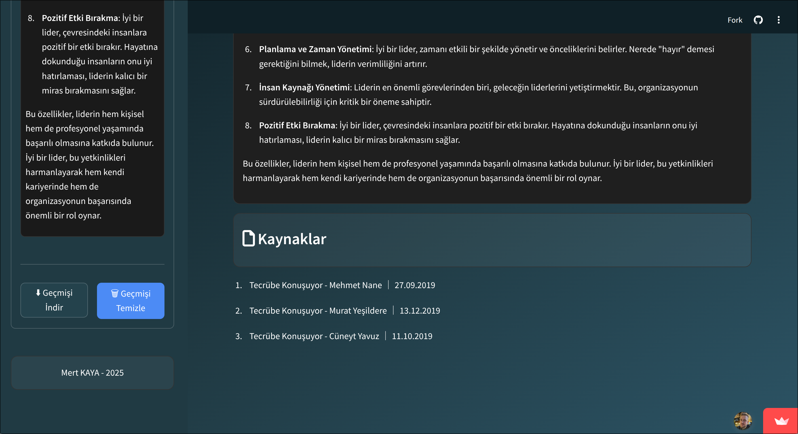

# Leadership-Coach-Chatbot

A Turkish leadership coach chatbot built with Streamlit. It answers leadership questions from a local set of transcript chunks using embedding similarity and GPT-4o, and falls back to Google search when the local content is not relevant.

## How to Run

1. Clone the repo and install dependencies:

```bash
git clone https://github.com/mertkayacs/Leadership-Coach-Chatbot.git
cd Leadership-Coach-Chatbot
pip install -r requirements.txt
```

2. Set the required API keys as environment variables. `OPENAI_API_KEY` is required by `langchain-openai`. `GOOGLE_API_KEY` and `GOOGLE_CSE_ID` (a Programmable Search Engine ID) are required for the Google search fallback.

3. Start the app:

```bash
streamlit run steamlit_leadership_chatbot.py
```

On first load the app encodes the chunks from `turkish_chunks.json` with the local embedding model. No database or vector server is needed.

The data preparation scripts (`audio_downloader.py`, `transcript_maker_whisper.py`, `prepare_transcripts.py`) download a YouTube playlist with yt-dlp, transcribe it with Whisper, and chunk the transcripts into `turkish_chunks.json`. They are only needed to rebuild the data. The Weaviate upload scripts are not used by the app.

## Screenshots





## Tech Used

- Python, Streamlit
- sentence-transformers (`paraphrase-multilingual-MiniLM-L12-v2`) for local embeddings
- scikit-learn for cosine similarity
- LangChain: `langchain-openai` (GPT-4o), `langchain-google-community` (Google search fallback)
- OpenAI Whisper and yt-dlp for transcript preparation

## Status

Side project, 2025.
